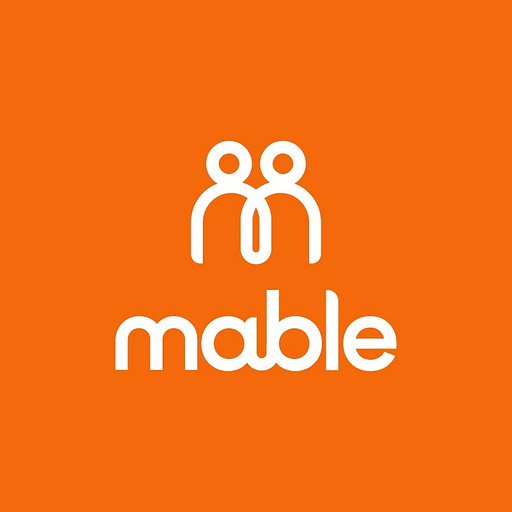



  <!-- Centered experience toggle (top of page) -->
  

    View my experience as
    

      <button data-set="software" type="button" aria-pressed="true">Software Engineer</button>
      <button data-set="data" type="button" aria-pressed="false">Data Engineer</button>
    

  

  <!-- Compact experience toggle (appears on scroll, stays) -->
  

    View as
    

      <button data-set="software" type="button" aria-pressed="true">SWE</button>
      <button data-set="data" type="button" aria-pressed="false"> DE</button>
    

  

  <!-- Vertical side nav -->
  <aside class="side-nav" aria-label="Section navigation">
    <a href="#top" data-sec="top" class="active">Home</a>
    <a href="#experience" data-sec="experience">Work</a>
    <a href="#certs" data-sec="certs">Certs</a>
    <a href="#thoughts" data-sec="thoughts">Writing</a>
    <a href="#contact" data-sec="contact">Connect</a>
  </aside>

  <header id="top">
    

      

        <!-- LEFT cell: bio (flex column) -->
        

          Portfolio / 2026
          

            
            <h1>Chris Zingel.</h1>
          

          
 Software engineer experience in  Python, Ruby & Rails  — building reliable web apps, APIs, and automations from A to Z. 
                Mostly working in the Data Engineering space nowadays.
            

          
As a data engineer, I bring extensive expertise in data processing, interpretation, and visualization — working across Python, SAS, with hands-on experience in Databricks, dbt, Power BI  and Snowflake.

          

            
              <svg width="16" height="16" viewBox="0 0 24 24" fill="none" stroke="currentColor" stroke-width="2" stroke-linecap="round" stroke-linejoin="round"><path d="M20 10c0 6-8 12-8 12s-8-6-8-12a8 8 0 0 1 16 0Z"/><circle cx="12" cy="10" r="3"/></svg>
              Tauranga,New Zealand
            
            <a class="btn btn-ghost" href="https://YOUR-BUCKET.s3.amazonaws.com/chris-zingel-cv.pdf" download>↓ Download CV</a>
          

        

        

          

            
Currently

            
Software Engineer

            
Available for new contracts

          

          

            
Focus

            

              Python
              Ruby
              Ruby on Rails
              Git
              PostgreSQL
              AWS
            

            

              dbt
              Snowflake
              Databricks
              Git
              Python
              AWS
              SAS
              Power BI
            

          

        

      

    

  </header>

  <section id="experience" class="reveal">
    

      
// experience

      <h2>Work Experience</h2>
      <!-- Example entries based on the reference layout — replace with your own roles -->
      

        

          
2025 — 2026

          

            
Senior Data Engineer

            
 Fulcrum Decision (FDL) · Contract

            
Data engineering consultant to OfficeMax. Built ETL pipelines with dbt and Snowflake (Azure Blob Storage as the data lake), integrating Stibo and Oracle Pronto, and supported Sisense and Power BI reporting for campaigns and share-of-wallet analysis.

          

          

            dbtSnowflakeAzure
            Power BISisense
          

        

        

          
2024 — 2025

          

            
Senior Data Engineer

            
 Health New Zealand | Te Whatu Ora

            
Led the design and delivery of data solutions on Snowflake and dbt — national cost collection, master data quality reporting, and national spend visibility — with strong governance around data quality, PII, security, and auditability.

          

          

            SnowflakedbtPython
            Data Governance
          

        

        

          
2022 — 2023

          

            
Data Engineer (SAS Consultant)

            
 ANZ · Contract

            
SAS consultant on ANZ's Customer Remediation programme — data extraction, transformation, and analysis to identify and rectify historical banking issues, translating business needs into technical specs. Runner-up at the 2022 Aotearoa EnviroHack.

          

          

            SASSQLData Analysis
          

        

        

          
2020 — 2022

          

            
Machine Learning &amp; Data Engineering

            
 Mable · Full-time

            
Built Mable's recommender engine for client matching and behaviour-risk detection, automated NDIS-compliant bulk invoicing, and built dbt pipelines from Redshift, Postgres, and Salesforce plus Tableau dashboards.

          

          

            DatabricksdbtPython
            SparkRedshift
          

        

        

          
2017 — 2020

          

            
Senior Software Engineer

            
 Mable · Full-time

            
Built the reference-checking onboarding flow that sped up onboarding while improving platform safety and worker vetting. Mentored staff, ran code reviews, and collaborated with product, UX, and design.

          

          

            Ruby on RailsPostgreSQL
            RedisSalesforce
          

        

        

          
2016 — 2017

          

            
Senior Developer

            
 POSmusic · Full-time

            
Improved backend and frontend apps serving licensed in-store music and ads, built the retail staff/manager permission system and multi-site store accounts, and automated playlist generation.

          

          

            Ruby on RailsAngularJS
            AWSPostgreSQL
          

        

        

          
2014 — 2015

          

            
Lead Software Developer

            
 Brandkit®

            
Built BrandKit, a cloud-based brand management system delivering logo files and brand style guides, with AWS Rekognition metadata tooling — used by Tourism New Zealand and Auckland's ATEED.

          

          

            Ruby on RailsAWS
            ElasticsearchAngularJS
          

        

        

          
2011 — 2014

          

            
Senior Developer

            
 Digital Dialogue

            
Built mobile and web solutions for clients including Chrysler Australia and BGC — front-end (HTML/CSS/JS) and Ruby on Rails back-ends, including a dealership test-drive app and an e-auction site.

          

          

            Ruby on RailsJavaScript
            HTML/CSS
          

        

      

    

  </section>

  <section id="certs" class="reveal">
    

      
// certifications

      <h2>Certifications</h2>
      

        

          
2025

          

            
            

              
SnowPro Core Certification

              
Snowflake

              
Issued: Aug 2025 · Expires: Aug 2027 Credential ID: 156908869

              
Certified in Snowflake data warehousing and cloud data platform fundamentals.

            

          

        

        

          
2025

          

            
            

              
dbt Developer

              
dbt Labs

              
Issued: Feb 2025 · Expires: Feb 2027 Credential ID: 135541190

              
Certified in building, testing, and deploying data transformation pipelines using dbt.

            

          

        

      

    

  </section>

  <section id="thoughts" class="reveal">
    

      

        <h2>Recent Thoughts</h2>
        <a class="view-all" href="blog/">View all posts →</a>
      

      
      <!-- DATA posts (auto-generated from _posts where category: data) -->
      

        
        
        <a class="thought" href="{{ post.url | relative_url }}">
          
{{ post.date | date: "%b %Y" }}{{ post.read }}

          <h3>{{ post.title }}</h3>
          
{{ post.description }}

          Read more &rarr;
        </a>
        
      

      <!-- SOFTWARE posts (auto-generated from _posts where category: software) -->
      

        
        
        <a class="thought" href="{{ post.url | relative_url }}">
          
{{ post.date | date: "%b %Y" }}{{ post.read }}

          <h3>{{ post.title }}</h3>
          
{{ post.description }}

          Read more &rarr;
        </a>
        
      

      
    

  </section>

  <section id="contact" class="reveal">
    

      

        <!-- LEFT: intro -->
        

          <h2>Let's Connect</h2>
          
Always interested in new opportunities, collaborations, and conversations about data engineering and software development.

          <a class="connect-email" href="mailto:chris@zingel.co.nz">chris@zingel.co.nz →</a>
        

        <!-- RIGHT: find me on -->
        

          
Find me on

          

            <a class="conn-card" href="https://github.com/chriszingel" target="_blank" rel="noopener">
               GitHub
              @chriszingel
            </a>
            <a class="conn-card" href="https://www.linkedin.com/in/czingel/" target="_blank" rel="noopener">
               LinkedIn
              Chris Zingel
            </a>
          

        

      

    

  </section>

  <footer>
    

      <button class="theme-toggle" id="theme-toggle" type="button" aria-label="Toggle colour theme">
        ☀ Light mode
      </button>
      
©  Chris Zingel · Built with care

    

  </footer>

  

